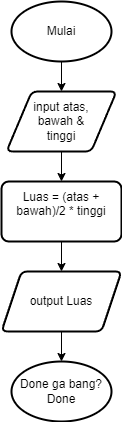

# Latihan – Introduction to Algorithm and Golang
## 1. Sebutkan berbagai bahasa pemrograman yang bisa digunakan untuk mengembangkan aplikasi backend!
### Berikut beberapa bahasa untuk mengembangkan aplikasi backend!
* Golang
* JavaScript
* Rust
* Python
* Java
* C#
* PHP
* Ruby
* Kotlin
* Swift

Ref : https://kelas.work/blogs/daftar-bahasa-bahasa-pemrograman-backend-yang-harus-diketahui , https://roadmap.sh/backend

## 2. Sebutkan dan jelaskan berbagai teknologi yang perlu dipelajari untuk menjadi seorang backend engineer!

* Operating System Knowledge : diperlukan untuk mengetahui dasar dalam mengoperasikan cmd pada terminal seperti cd, wget, curl, dll. pada Windows atau cd, ls, chmod, nano, dll. pada Linux. contoh OS adalah : Windows, Linux, Darwin(MacOS), dll.

* Programming Languages : bahasa pemrograman sangat penting untuk menjadi seorang software developer terkhusus backend. Bahasa pemrograman yang dapat digunakan ada beberapa macam, seperti : Golang, JavaScript, Python, dll.

* Frameworks : framework sendiri digunakan backend programmer untuk mempermudah dalam mengembangkan sebuah software. Berikut contoh frameork yang umum digunakan : Echo Golang, Express.js, Django, dll.

* Database Management Systems (DBMS) : merupakan sistem penyimpanan untuk mengatur penyimpanan dari sebuah aplikasi. Contoh database sebagai berikut : MySQL, PostgreSQL (SQL Database), MongoDB (NoSQL Database), dll. Tambahan untuk database : ORM, Transactions, Normalization, ACID

* API Development : kegunaan Application Programming Interface(API) yaitu sebagai perantara klien dan server untuk saling berkomunikasi. Contoh API yang umum yaitu : RESTful API

* Version Control : digunakan untuk bekerja secara efektif dalam memantau perubahan pada baris code sehingga mempermudah dalam melakukan pengembangan baik secara individu atau secara tim. Contoh version control yaitu : Git, GitHub, dll.

* Caching : teknik menyimpan data yang sering digunakan ke dalam memori lokal untuk meningkatkan kinerja dalam mengembangkan software. Berikut contohnya : Redis, Client Side, Server Side, dll.

* Security : security merupakan tahapan dalam pengembangan aplikasi yang berguna untuk melindungi aplikasi dari ancaman yang akan mempengaruhi kinerja dari sebuah aplikasi. Berikut beberapa contohnya : HTTPS, SSL, MD5, Authentication and Authorization, dll.

* Testing : pengujian pada sebuah aplikasi bertujuan untuk memastikan tidak adanya fitur yang berjalan secara abnormal atau tidak sesuai fungsi yang dapat mempengaruhi kinerja sebuah aplikasi. Berikut contohnya : Unit Testing, Integration Testing, dll.

* CI/CD : CI/CD merupakan tindakan pembuatan, pembuata, dan penerapan aplikasi secara otomatis untuk menganalisis masalah diawal.

* Software Architectural : arsitektur software merupakan bentuk dalam mengembangkan suatu software dan biasanya memiliki pola. Berikut pola arsitektur yaitu : Microservices, Monolithic, Serverless, dll.

* Software Management (Containerization) : mempermudah pengembang dengan cara mengemas aplikasi kedalam sebuah kontainer. Berikut contohnya : Docker, kubernetes, dll.

* Web Servers : berguna unuk menajalankan sebuah aplikasi yang menerima permintaan dan mengirimkan respon dalam bentuk halaman web atau data. Contohnya : Nginx, Apache, dll.

Ref : https://roadmap.sh/backend, https://blog.back4app.com/backend-frameworks/

## 3. Buatlah sebuah flowchart untuk menghitung luas trapesium.

[